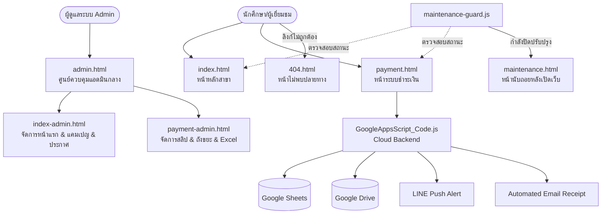

# 🗺️ แผนผังและคู่มือโครงสร้างไฟล์ทั้งหมดในโปรเจกต์ (Project Site Map & Architecture)
**สาขาวิชาคอมพิวเตอร์ศึกษา คณะศึกษาศาสตร์ มหาวิทยาลัยขอนแก่น (COMED KKU 69)**

เอกสารฉบับนี้จัดทำขึ้นเพื่ออธิบายและจัดหมวดหมู่ไฟล์ทุกประเภทในโปรเจกต์อย่างละเอียด ชัดเจน ให้ทราบว่าแต่ละไฟล์ทำหน้าที่อะไร มีความเชื่อมโยงกันอย่างไร และใช้งานในส่วนใดบ้าง (โดยไม่มีการลบไฟล์ใดๆ ออก)

---

## 🌟 1. หมวดหมู่หน้าเว็บหลัก (HTML Web Pages)

ไฟล์ `.html` ทั้งหมดในระบบแบ่งออกเป็น **3 กลุ่มหลัก** อย่างชัดเจน:

```
📦 แบบเก็บเงิน (Root Workspace)
 ├── 🌐 [1] กลุ่มหน้าบ้านสำหรับผู้ใช้งานทั่วไป (Public Pages)
 │    ├── index.html            👉 หน้าหลัก (Landing Page) ข้อมูลสาขา, ทำเนียบรุ่น 60 คน, ประกาศ
 │    └── payment.html          👉 หน้ารับชำระเงิน ตรวจสอบยอด แนบสลิป และแจ้งปัญหา
 │
 ├── 🛡️ [2] กลุ่มระบบจัดการผู้ดูแลระบบ (Admin Portals)
 │    ├── admin.html            👉 ศูนย์ควบคุมหลัก (Central Admin Hub) จุดรวมแอดมินทุกโมดูล
 │    ├── index-admin.html      👉 หน้า Admin จัดการเนื้อหาหน้าแรก ประกาศด่วน และเปิด/ปิดแคมเปญ
 │    └── payment-admin.html    👉 หน้า Admin จัดการการเงิน สลิป กู้คืนถังขยะ และส่งออก Excel
 │
 └── ⚠️ [3] กลุ่มหน้าแสดงสถานะระบบ (System Status & Guard Pages)
      ├── 404.html              👉 หน้าแจ้งเตือนเมื่อเข้าลิงก์ผิด / ไม่มีอยู่จริง พร้อมปุ่มย้อนกลับ/รีเฟรช
      └── maintenance.html      👉 หน้าแสดงเมื่อเปิดโหมดปิดปรับปรุงเว็บ พร้อมนาฬิกานับถอยหลัง Real-time
```

---

### 📋 ตารางแจกแจงหน้าที่ของไฟล์ HTML แต่ละตัว:

| ชื่อไฟล์ | สถานะการใช้งาน | กลุ่มผู้ใช้งาน | หน้าที่หลักและความสำคัญ |
| :--- | :---: | :---: | :--- |
| **`index.html`** | ใช้งานหลัก (Active) | นักศึกษา / บุคคลทั่วไป | **หน้าแรกของเว็บไซต์** แสดงข้อมูลแนะนำสาขาวิชา, หลักสูตร, ทำเนียบรุ่น 60 คน, บัตรสถานะการจ่ายเงิน และแบนเนอร์รายการเก็บเงิน |
| **`payment.html`** | ใช้งานหลัก (Active) | นักศึกษา 60 คน | **หน้าระบบชำระเงิน** ตรวจสอบยอดเงิน ฿190, สแกน QR Code, แนบสลิป, ตรวจสอบสถานะการจ่าย, ระบบแจ้งปัญหา (Help Desk) |
| **`admin.html`** | ใช้งานหลัก (Active) | ผู้ดูแลระบบ (Admin) | **ศูนย์บัญชาการแอดมินกลาง (Central Hub)** รวมสถานะการเงิน Real-time, ตัวควบคุมเปิด-ปิดปรับปรุงเว็บ, และลิงก์ไปทุกส่วน |
| **`index-admin.html`** | ใช้งานหลัก (Active) | ผู้ดูแลระบบ (Admin) | **หน้าจัดการหน้าแรก & แคมเปญ** ควบคุมข้อความประกาศด่วน (Announcement Bar), เพิ่มแคมเปญเก็บเงินใหม่, จัดการรายชื่อนักศึกษา |
| **`payment-admin.html`** | ใช้งานหลัก (Active) | ผู้ดูแลระบบ (Admin) | **ระบบแอดมินการเงิน** ตรวจสอบสลิป, อนุมัติยอด, กู้คืน/ลบถาวรในถังขยะ, และส่งออกไฟล์ Excel แท้ (.xlsx) พร้อม Cell Colors |
| **`404.html`** | ใช้งานระบบ (System) | ผู้ใช้ที่พิมพ์ URL ผิด | **หน้า Error 404** ป้องกันไม่ให้เว็บล่ม มีปุ่ม **รีเฟรช**, **ย้อนกลับ**, และ **กลับหน้าหลัก** |
| **`maintenance.html`** | ใช้งานระบบ (System) | ผู้ใช้งานขณะปิดระบบ | **หน้าปิดปรับปรุงระบบ** มีนาฬิกานับถอยหลัง (Countdown) และเปิดระบบให้อัตโนมัติเมื่อครบกำหนด (Admin ไม่ถูกบล็อก) |

---

## 🎨 2. หมวดหมู่ไฟล์สไตล์และสคริปต์ (Modular Assets)

ไฟล์ CSS และ JavaScript ได้ถูกแยกออกจากหน้า HTML อย่างเป็นระเบียบตามโฟลเดอร์ `assets/` ดังนี้:

### 📁 `assets/css/` (ไฟล์สไตล์ตกแต่ง)
- **`index.css`** ➔ CSS ดีไซน์ของหน้าแรก `index.html` (Modern Light/Clean Glassmorphism)
- **`payment.css`** ➔ CSS ดีไซน์ของหน้าระบบชำระเงิน `payment.html` (Cyber Modern Luxury)
- **`admin.css`** ➔ CSS ดีไซน์ของหน้าจัดการการเงิน `payment-admin.html`
- **`master-admin.css`** ➔ CSS ดีไซน์ Dark Mesh Glassmorphism ของ `admin.html` และ `index-admin.html`

### 📁 `assets/js/` (ไฟล์ระบบคำนวณและการทำงาน)
- **`index.js`** ➔ ตรวจสอบ Google One-Tap, ซิงค์ยอดเงิน Real-time, ระบบค้นหาทำเนียบรุ่น 60 คน
- **`payment.js`** ➔ ระบบอัปโหลดและพรีวิวสลิป, ตัวนับถอยหลังกำหนดจ่าย, ระบบส่งเรื่องแจ้งปัญหา
- **`admin.js`** ➔ ระบบตรวจสอบแอดมิน SHA-256, จัดการสลิป, กู้คืนถังขยะ, และ Export Excel `.xlsx`
- **`admin-hub.js`** ➔ ดึงข้อมูลสถิติภาพรวม Real-time และระบบควบคุมเปิด/ปิดปรับปรุงเว็บไซต์
- **`index-admin.js`** ➔ ตัวจัดการประกาศด่วน (Announcement CMS), เพิ่ม/แก้แคมเปญชำระเงิน, แก้ไขข้อมูลนักศึกษา
- **`maintenance-guard.js`** ➔ สคริปต์ตรวจจับ Maintenance Mode อัตโนมัติ (ข้ามหน้าแอดมินอัตโนมัติ)

---

## ⚙️ 3. หมวดหมู่การตั้งค่าและฐานข้อมูล (Config & Database Integrations)

- **`config/campaigns_repo.js`** ➔ คลังเก็บข้อมูลแคมเปญกิจกรรมการเงินแยกรายตัว (เช่น ค่าทำป้าย, เงินห้อง) พร้อมเชื่อมโยง API Google Apps Script, Google Sheet, Form และ Drive แยกรายโครงการ
- **`config/app_config.js`** ➔ ข้อมูลทั่วไปของระบบ เช่น เวอร์ชัน วันที่อัปเดต ธนาคารรับเงิน และช่องทางติดต่อ
- **`students_data.js`** ➔ ฐานข้อมูลรายชื่อ รหัสนักศึกษา ชื่อเล่น และอีเมล @kkumail.com ของนักศึกษาทั้ง 60 คน
- **`GoogleAppsScript_Code.js`** ➔ ซอร์สโค้ด Backend API ที่รันบน Google Cloud สำหรับ:
  - รับข้อมูลและบันทึกลง Google Sheets
  - อัปโหลดไฟล์สลิปและสร้างลิงก์รูปบน Google Drive
  - ส่งการแจ้งเตือนสลิปและปัญหาเข้า **LINE Notify / Push Message**
  - ส่ง **Email ใบเสร็จยืนยัน (Automated Email Receipt)** ตรงไปยังอีเมลของนักศึกษา

---

## 🖼️ 4. หมวดหมู่ไฟล์รูปภาพ (Media Assets)

- **`logo.png`** ➔ โลโก้ทางการของสาขาวิชาคอมพิวเตอร์ศึกษา มหาวิทยาลัยขอนแก่น
- **`qr_payment.png`** ➔ รูปภาพ QR Code บัญชีธนาคารสำหรับสแกนชำระเงิน

---

## 🐍 5. หมวดหมู่ Local Python Backend & Scripts (สำหรับรัน Local Server)

- **`server.py`** ➔ เซิร์ฟเวอร์ Python SQLite เสริม สำหรับรันจำลอง Backend ภายในเครื่องแบบ Local
- **`payments.db`** ➔ ไฟล์ฐานข้อมูล SQLite ท้องถิ่น (ใช้เมื่อรันผ่าน server.py)
- **`backend/` & `scripts/`** ➔ โฟลเดอร์สำหรับสคริปต์ประมวลผลเพิ่มเติม
- **`uploads/`** ➔ โฟลเดอร์เก็บไฟล์สลิปชั่วคราวเมื่อรันเซิร์ฟเวอร์แบบ Local

---

## 📚 6. หมวดหมู่คู่มือเอกสาร (Documentation)

- **`docs/PROJECT_STRUCTURE.md`** ➔ แผนผังและคำอธิบายโครงสร้างระบบทั้งหมด
- **`docs/SYSTEM_HANDOVER_GUIDE.md`** ➔ คู่มือการส่งมอบงานและการใช้งานระบบสำหรับแอดมินรุ่นถัดไป
- **`docs/HOW_TO_CONNECT_GOOGLE_SHEETS.md`** ➔ วิธีการติดตั้งและเชื่อมต่อ Google Sheets & Apps Script
- **`DEPLOY_GUIDE.md`** ➔ คู่มือการนำระบบขึ้น Production (GitHub Pages / Vercel / Cloudflare)

---

### 💡 แผนผังการเชื่อมโยงระบบ (System Flowchart)


